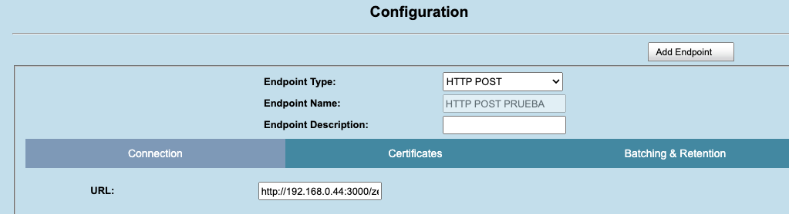
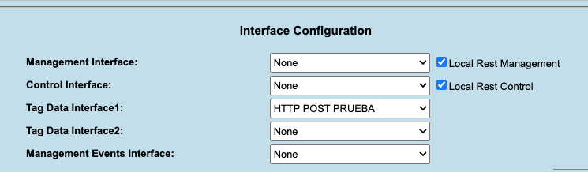

##Los parametros permitidos en la configuración son: 

antenna
eventNum
format
idHex
peakRssi
reads
name
timestamp
localDate
localTime
ip

Se separan con comas ejemplo: 

orden=idHex,name,antenna,date,localDate,localTime,ip


##Terminador de líneas

Es el terminador que se agrega al final de cada linea, puede ser \n o \r\n

##Separador de palabras
El separador de palabras separa el EPC en bloques de 4 caracteres

separador_palabras=true

##Prueba

Server Socket: nc -l 10000

###formato de configuración Zebra de envio de datos: 

```http://[ip del server]:[puerto]/zebra/[nombre del lector]```

```http://192.168.0.44:3000/zebra/Lector1```





